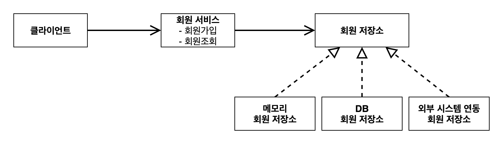
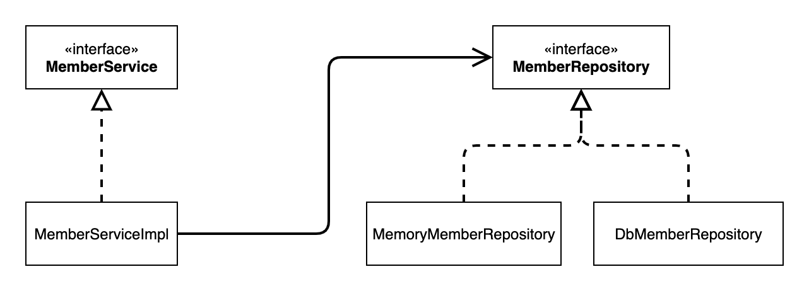

# 요구사항: 비즈니스 요구사항과 설계
* 회원
  1. 회원을 가입하고 조회할 수 있다.
  2. 회원은 일반과 VIP 두 가지 등급이 있다.
  3. 회원 데이터는 자체 DB를 구축할 수 있고, 외부 시스템과 연동할 수 있다.(미확정)   
   

* 주문과 할인 정책
  1. 회원은 상품을 주문할 수 있다.
  2. 회원 등급에 따라 할인 정책을 적용할 수 있다.
  3. 할인 정책은 모든 VIP는 1000원을 할인해주는 고정 금액 할인을 적용해달라. (나중에 변경 될 수 있다.)
  4. 할인 정책은 변경 가능성이 높다. 회사의 기본 할인 정책을 아직 정하지 못했고, 오픈 직전까지 고민을 미루
  고 싶다. 최악의 경우 할인을 적용하지 않을 수 도 있다. (미확정)   

**Tip**  
요구사항을 보면 회원 데이터, 할인 정책 같은 부분은 지금 결정하기 어려운 부분이다.  
그렇다고 이런 정책이 결정될 때 까지 개발을 무기한 기다릴 수 없다.   
우리는 앞에서 배운 객체 지향 설계 방법이 있지 않은가!   
인터페이스를 만들고 구현체를 **언제든지 갈아끼울 수 있도록 설계**하면 된다.

# 코드 다이어그램

* 회원 도메인 협력 관계
   

* 회원 **클래스** 다이어그램

* MebmerService: 클라이언트
* MemberServiceImpl: 회원 서비스
* MemberRepository: 회원 저장소

   

* 회원 **객체** 다이어그램

* 회원 서비스: **MemberServiceImpl**